# Sistema de Gestión de Capacitaciones

Sistema web interno desarrollado para la **Coordinación de Capacitación, Vinculación y Difusión de Protección Civil**, diseñado para centralizar el registro, programación, consulta, administración y análisis de las capacitaciones y actividades.

El sistema permite administrar desde una única aplicación web: 
- Registrar, editar y eliminar capacitaciones y actividades.
- Programación y visualización mediante calendario.
- Consulta histórica mediante filtros.
- Administración de instructores.
- Administración de catálogos.
- Control de estatus.
- Almacenamiento de listas de asistencia en PDF.
- Estadísticas mediante Dashboard.
- Generación de reportes PDF.
- Registro del usuario que creó y modificó cada capacitación.
- Respaldos automáticos diarios.

## Problemática 

Antes de la implementación, se consultaban las capacitaciones mediante un calendario manual en Excel o mediante oficios y documentos almacenados en el archivo.

Para obtener estadisticas se recopilaban las actividades en un archivo de Excel y posteriormente se utilizaban herramientas de inteligencia artificial para generar gráficas requeridas.

El principal problema era la recopilación de la información, ya que preparar el Excel con la lista y los datos de las capacitaciones podía tomar **hasta dos días**, antes de comenzar con el análisis y la generación de estadísticas.

## Solución

Se desarrolló una plataforma web que centraliza la información y permite reutilizar los datos registrados en los diferentes módulos.

```text
             Registro de actividad
                        │
                        ▼
                      MySQL
                        │
   ┌────────────────────┼─────────────────┐
   ▼                    ▼                 ▼ 
Calendario     Consulta histórica     Dashboard
                                          │
                                          ▼
                                      Reporte PDF
```

La información se registra una sola vez y posteriormente puede utilizarse para agenda, consulta, estadísticas y reportes.

# Funcionalidades 

## Login y registro 
El sistema utiliza **Spring Security** para la autenticación.

Características:

- Inicio de sesión mediante usuario y contraseña.
- Registro de nuevos usuarios.
- Validación de nombres de usuario duplicados.
- Confirmación de contraseña.
- Contraseñas almacenadas mediante BCrypt utilizando `PasswordEncoder`.
- Los usuarios registrados pueden acceder inmediatamente.
- Aproximadamente 8 usuarios.
- Todos los usuarios tienen los mismos permisos.
- Uso restringido a la red interna.
- No existe expiración configurada por tiempo para la sesión.

## Login
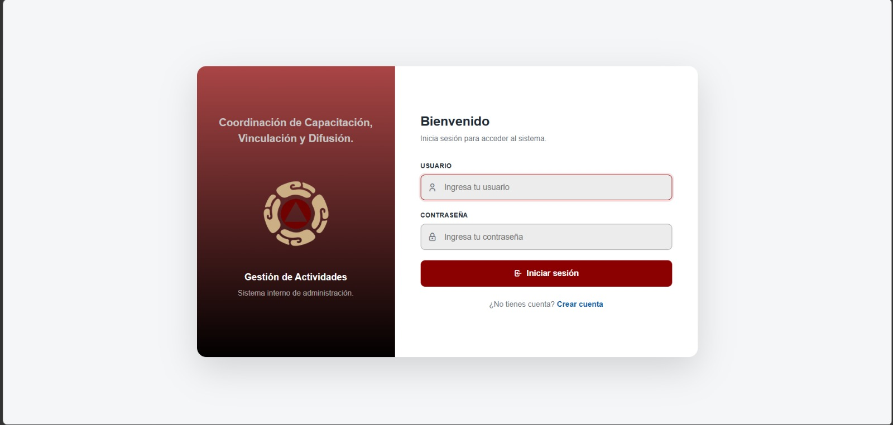


## Registro
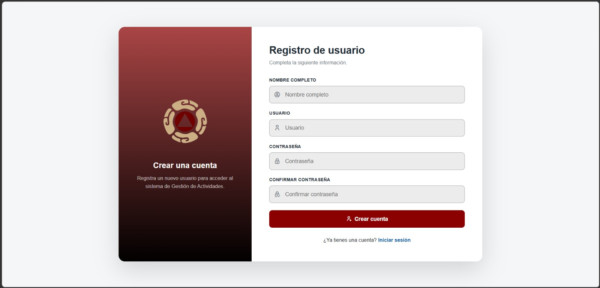

## Nueva actividad / capacitación
Permite registrar la información de la actividad con todos los datos y adjuntar lista de asistencia de la actividad, se permite: 
- Adjuntar archivos PDF.
- Archivos de hasta 10 MB.
- Reemplazar archivos existentes.
- Mantener los PDF físicamente en el servidor.
- Almacenar únicamente la ruta en la base de datos.

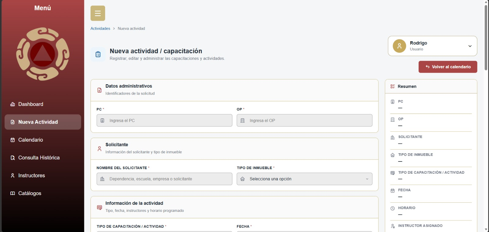
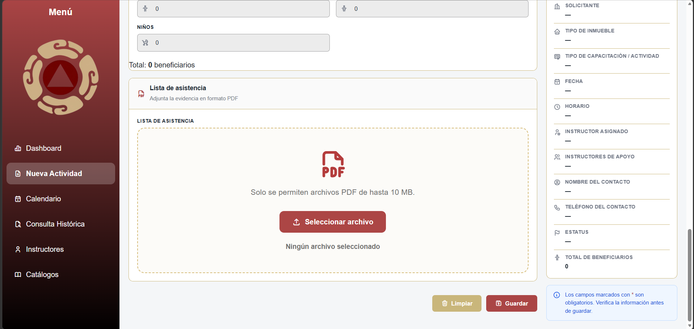

## Calendario

El calendario permite visualizar las capacitaciones y actividades como una agenda.

Cuenta con:

- Vista mensual.
- Vista semanal.
- Actividades programadas o realizadas.
- Modal con información detallada.
- Acceso a edición desde el detalle.

El modal muestra todos los datos de la actividad y usuario que registro y/o modifico con su respectiva fecha y hora.

El resumen mostrado en el calendario corresponde **únicamente al mes que se está visualizando**. Las estadísticas específicas por periodos se encuentran en el Dashboard.

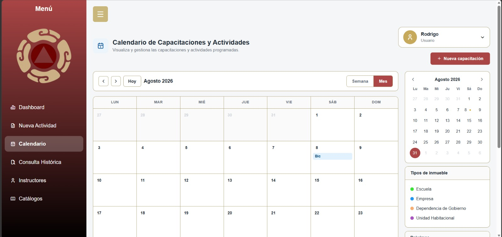
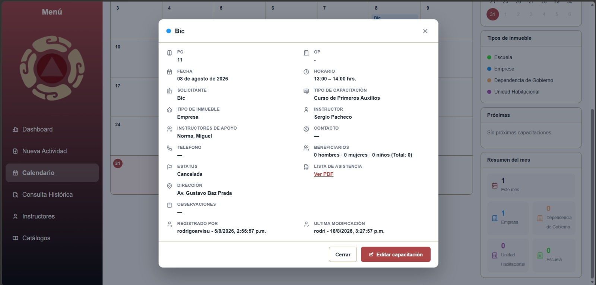

## Consulta histórica

Permite localizar capacitaciones y actividades anteriores mediante filtros:

- Fecha de inicio.
- Fecha de fin.
- Solicitante / inmueble.
- Tipo de inmueble.
- Tema.
- Estatus.
- Instructor.
- PC.
- OP.

Los resultados cuentan con paginación.

Desde la consulta se puede editar, eliminar y consultar la actividad.

La eliminación requiere confirmación mediante **SweetAlert** y no puede deshacerse.

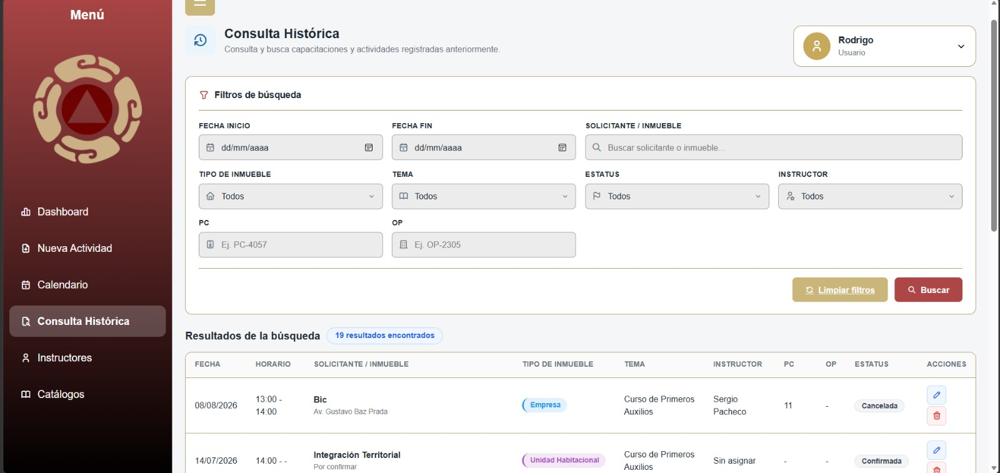

## Instructores

Permite:

- Registrar instructores.
- Editarlos.
- Activarlos.
- Inactivarlos.
- Consultar próximas capacitaciones asignadas.
- Consultar capacitaciones realizadas.
- Consultar su historial.

Cuando un instructor se inactiva, deja de aparecer como opción para nuevas asignaciones, pero permanece en el sistema para conservar sus registros históricos. Puede volver a activarse posteriormente.

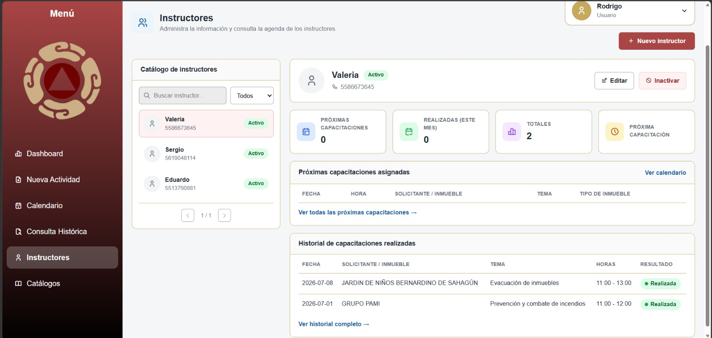

### Catálogos

El módulo permite administrar información utilizada por el sistema.
 - Tipos de inmueble 
 - Tipos de capacitación 
 - Estatus

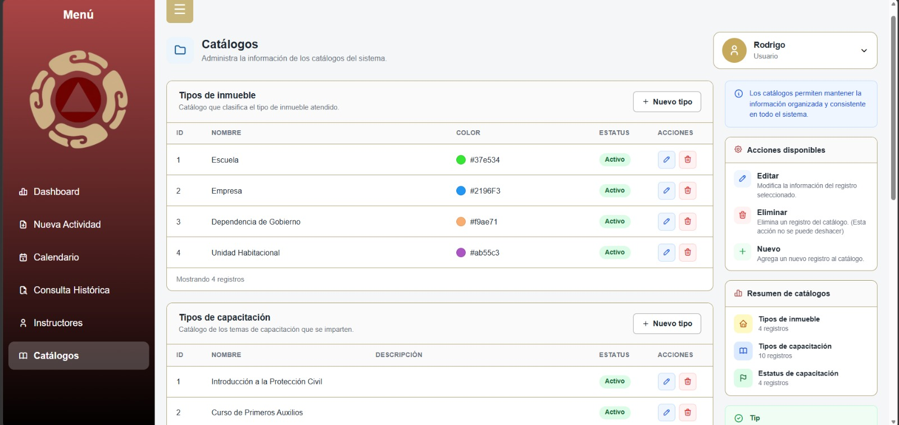

### Dashboard

El Dashboard concentra el análisis estadístico por medio de **filtros** (tipo de inmueble, tema, instructor, estatus, fecha de inicio, fecha de fin) y con **indicadores** (actividades totales, actividades realizadas, actividades programadas, actividades canceladas y horas impartidas)

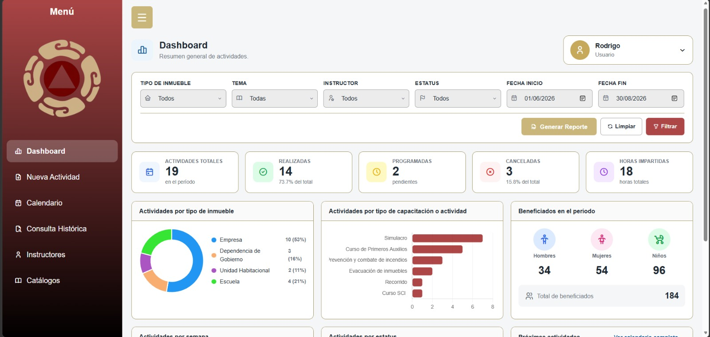

### Generación de reportes 
El dashboard permite generar un **reporte PDF** con base al periodo y filtros seleccionados 

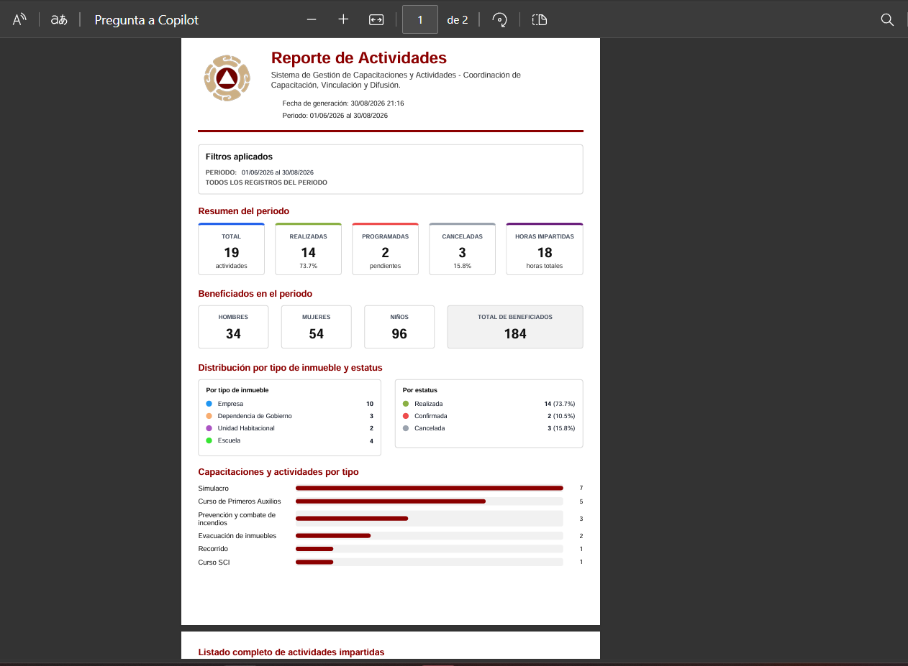

## Tecnologías 
### Backend

| Tecnología | Uso |
|---|---|
| **Java 17** | Lenguaje principal |
| **Spring Boot 3.5.15** | Framework principal |
| **Spring Web MVC** | Rutas HTTP y controladores |
| **Spring Data JPA** | Persistencia y acceso a datos |
| **Hibernate** | ORM utilizado por JPA |
| **Spring Security** | Autenticación, sesiones y protección |
| **thymeleaf-extras-springsecurity6** | Integración de Spring Security con vistas |
| **MySQL Connector/J** | Conexión con MySQL |
| **Lombok** | Reducción de código repetitivo |
| **OpenHTMLtoPDF / PDFBox** | Generación de reportes PDF |
| **Spring Boot DevTools** | Herramientas de desarrollo |

### Frontend

| Tecnología | Uso |
|---|---|
| **Thymeleaf** | Motor de plantillas |
| **HTML / CSS / JavaScript** | Interfaz e interactividad |
| **Bootstrap 5.3.3** | Diseño y componentes |
| **Tabler Icons** | Iconografía |
| **Notyf** | Notificaciones tipo toast |
| **SweetAlert** | Mensajes y confirmaciones |
| **Chart.js** | Gráficas |

### Base de datos

| Tecnología | Uso |
|---|---|
| **MySQL 8** | Base de datos relacional |

### Construcción y despliegue

| Tecnología | Uso |
|---|---|
| **Maven** | Compilación y dependencias |
| **Docker / Docker Compose** | Pruebas y validación |
| **NSSM** | Ejecución del `.jar` como servicio de Windows |
| **PowerShell** | Automatización de respaldos |

## Arquitectura y despliegue

El sistema funciona como una aplicación web interna.

Un equipo con **Windows 11** fue destinado como servidor web dentro del área. Los demás equipos acceden mediante la **IP del servidor** a través de la red interna.

```text
                 RED INTERNA
                      │
        ┌─────────────┼─────────────┐
        │             │             │
     Cliente       Cliente       Cliente
        │             │             │
        └─────────────┼─────────────┘
                      │
                      ▼
             ┌──────────────────┐
             │     SERVIDOR     │
             │    Windows 11    │
             │                  │
             │   Spring Boot    │
             │   MySQL 8        │
             │   PDFs           │
             │   NSSM           │
             └──────────────────┘
```

Los equipos cliente no necesitan instalar Java, MySQL, Maven, Docker ni las dependencias del proyecto. Únicamente requieren un navegador y acceso a la red interna.

## Estado del proyecto

**Implementado y desplegado en producción**
El sistema actualmente se encuentra disponible dentro la red interna de la institución

## Autor 
**Rodrigo Arvisu**

Proyecto desarrollado para la **Coordinación de Capacitación, Vinculación y Difusión de Protección Civil**.


